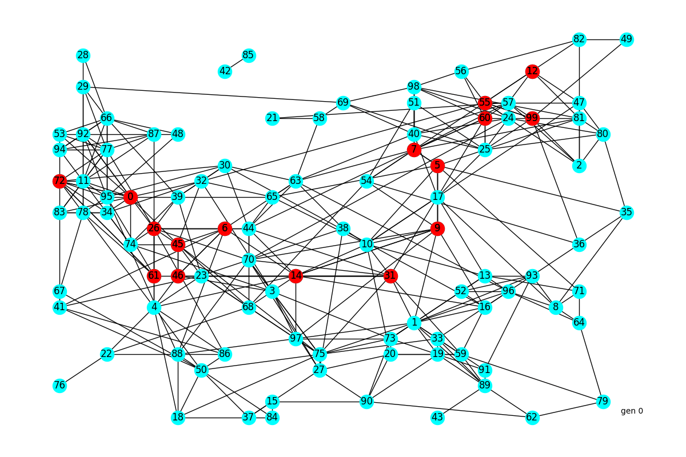

# Genetic Algorithm
A genetic algorithm is a meteheuristic approach to solve optimization problems. It is able to find good solutions to otherwise very complex and computational intensive problems. 
This repository presents generic functionality to implement a simple genetic algorithm. 

This algorithm works in the following way: 
- Every member in the population is encoded into a list of values. Different encodings (binary, integers, etc.) are possible. 
- The members of the first generation are randomly initialized. 
- After sorting the population based on the fitness value, a predefined proportion of **elitist** members is passed to the next generation. 
- For a predefined proportion of members goes through the **crossover** process. Performance at the task has no effect on the likelihood of being selected. 
- **Mutated** copies of a predefined proportion of elitist and crossover members are added to the new population. 
- The population of the new generation is filled up with randomly initialized members until the target population size is reached. 

## How to use it
As can be seen in the examples in the *experiments* directory, the optimizer has to be initialized wih the following parameters: 
- *create_member_fun* returns a randomly created member in form of a list
- *mutate_fun* defines the behaviour during mutation of a member and returns the mutated member
- *crossover_fun* defines the behaviour during the crossover of two members and returns the new member
- *evaluation_fun* returns the fitness value of a member
- *p_elitism* defines the proportion of members that are passed to the next generations
- *p_crossover* defines the proportion of members of the next population that originate in crossover
- *p_mutate* defines the probability of an elitist or crossover member to have a mutated copy of itself in the next generation

## Example: shortest route
This example is an optimization problem of a randomly initialized graph in which the shortest route between the first and the last node has to be found. 
To initialize the graph, random node positions are selected and nearest nodes are connected. More connecions are added based on the exponential distribution applied on distance. 
Route members are initialized by randomly propagating through the graph until the last node is reached. This allows for loops and other imperfect constructs. 
During mutation, a segment of the route is randomly selected and replaced by a randomly created new segment. 
Finally, crossover allows routs that pass through the same nodes to exchange the route segment in between these nodes. 

The following animation shows the evolution of the shortest route example. Every frame represents one generation. 

